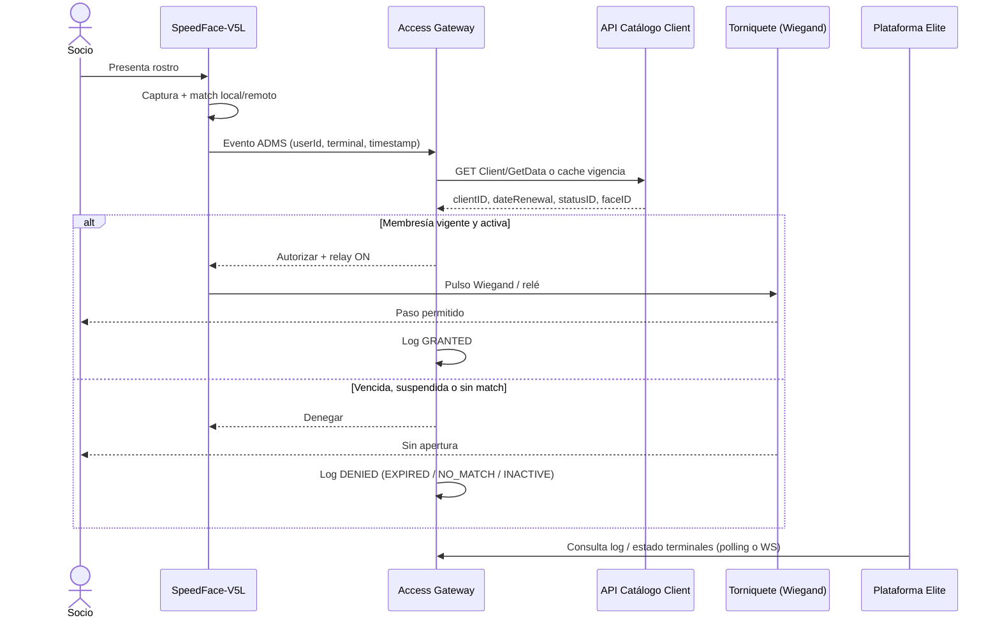
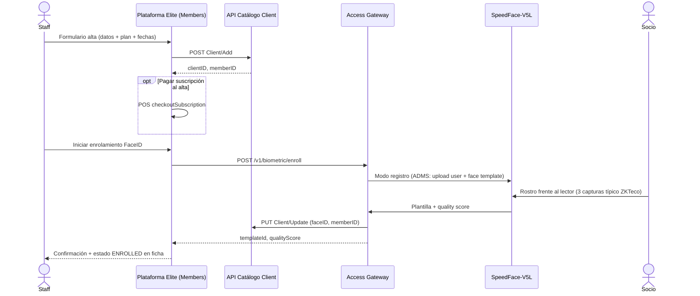
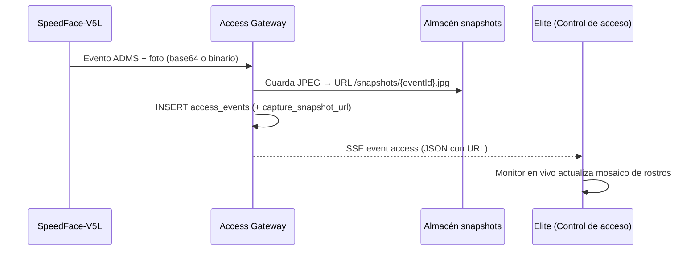

# Control de acceso biométrico — Arquitectura y flujos

Documento de referencia para **Elite Gym 24/7**: cómo controlar dispositivos ZKTeco, validar vigencia de membresía y operar torniquetes. Combina el hallazgo de campo (PDFs de discovery) con el diseño de la plataforma web y el trabajo pendiente de integración real.

**Última actualización:** junio 2026  
**Relacionado:** `README-FUNCIONALIDAD.md`, `README-TECNICO.md`, `docs/INTEGRACION-TORNIQUETE.md`, `src/app/lib/thirdPartyMocks.ts`

> **Torniquete:** integración física pendiente. Ver [INTEGRACION-TORNIQUETE.md](./INTEGRACION-TORNIQUETE.md) para contrato, checklist y sustitución de mocks.

---

## 1. Lo que hay hoy en el gimnasio (discovery)

Según los reportes de visita técnica:

| Componente | Detalle |
|------------|---------|
| **Terminal** | ZKTeco **SpeedFace-V5L** (reconocimiento facial ZKFace VX3.9) |
| **Red** | Ethernet cableada, LAN local |
| **Protocolo dispositivo → servidor** | **ADMS PUSH** hacia servidor local |
| **Software actual** | **XCore For Gym** |
| **Servidor ADMS** | `192.168.1.22:8096` (referencia observada en sitio) |
| **Torniquete** | Salida **Wiegand 26** desde la terminal (relé / controlador de torniquete) |
| **Capacidad** | ~2 780 usuarios, ~2 722 rostros registrados |

### Arquitectura actual en sitio

```
Socio → SpeedFace-V5L (ZKTeco)
              │
              │  ADMS PUSH (LAN)
              ▼
        Servidor XCore (192.168.1.22:8096)
              │
              ├── Base de datos local (usuarios, rostros, eventos)
              ├── Reglas de acceso / horarios
              └── Señal Wiegand 26 → Torniquete (abre / mantiene cerrado)
```

### Riesgos operativos (discovery)

- Punto único de falla: servidor local XCore.
- Sin redundancia visible ni respaldo automático documentado.
- Acceso dependiente de la LAN del gimnasio.

---

## 2. Lo que hay hoy en la plataforma Elite (código)

La web **no controla aún los dispositivos reales**. Simula el mismo flujo de negocio con mocks locales.

| Pieza | Ubicación | Estado |
|-------|-----------|--------|
| Pantalla operación accesos | `src/app/pages/AccessControl.tsx` | UI + flujo simulado |
| Contratos FaceID / torniquete | `src/app/lib/thirdPartyMocks.ts` | **Mock** (sustituir por HTTP) |
| Log de accesos y torniquetes | `src/app/lib/demoStore.ts` | **localStorage** del navegador |
| Alta de miembro + opción FaceID | `src/app/pages/Members.tsx` | Catálogo API real + enroll mock |
| Datos de socio (vigencia) | API Catálogo `Client/ViewAll` | `dateEnrollment`, `dateRenewal`, `faceID` |
| Validación de vigencia en acceso | — | **No implementada** en el mock actual |

### Flujo simulado hoy (Access Control)

1. Operador pulsa **Escanear rostro** → `mockFaceIdVerify`.
2. Si hay match → `mockTurnstileCommand(OPEN)` → log `GRANTED` → tras 1.8 s `CLOSE`.
3. Si no hay match → `mockTurnstileCommand(HOLD)` → log `DENIED`.

**Importante:** el mock **no consulta** el catálogo ni comprueba si la membresía está vigente; solo devuelve match aleatorio (~90 % éxito).

---

## 3. Arquitectura objetivo (recomendada)

Para los flujos que necesitas, la plataforma Elite debe tener un **servicio de acceso en el gym** (o en nube con VPN al gym) que hable con ZKTeco y con tus APIs de negocio.

```
┌─────────────────────────────────────────────────────────────────────────┐
│                         GIMNASIO (LAN)                                   │
│                                                                          │
│  SpeedFace-V5L ──ADMS PUSH──► Access Gateway (nuevo) ◄──► Torniquete    │
│       ▲                            │                      (Wiegand 26) │
│       │                            │                                     │
│       └── captura / enroll ────────┘                                     │
└────────────────────────────────────┼────────────────────────────────────┘
                                     │ HTTPS (o VPN)
                                     ▼
              ┌──────────────────────────────────────────┐
              │  APIs Tanosi (nube / Neubox)              │
              │  • Catálogo Client (miembros, vigencia)   │
              │  • Security (staff login)                 │
              │  • POS (opcional, no bloquea acceso)      │
              └──────────────────────────────────────────┘
                                     ▲
                                     │ HTTPS
              ┌──────────────────────┴──────────────────────┐
              │  Plataforma web Elite Gym (React)            │
              │  Members · Access Control · Reports          │
              └─────────────────────────────────────────────┘
```

### Rol de cada capa

| Capa | Responsabilidad |
|------|-----------------|
| **SpeedFace-V5L** | Captura rostro, identifica plantilla, envía evento al servidor ADMS, activa relé/Wiegand si se autoriza |
| **Access Gateway** | Servidor ADMS compatible (reemplazo/evolución de XCore), orquesta reglas, llama al catálogo, registra eventos |
| **Catálogo Client** | Fuente de verdad: `clientID`, `dateRenewal`, `dateExpiration`, `statusID`, `faceID`, plan |
| **Plataforma web** | Alta de socios, enrolamiento guiado, monitoreo, reportes; **no** debe abrir torniquetes directamente desde el navegador en producción |
| **Torniquete** | Hardware; se abre con pulso Wiegand o relé de la terminal |

### Relación con XCore actual

Tres caminos posibles (elegir uno en proyecto):

1. **Reemplazo gradual:** Access Gateway implementa ADMS PUSH y sincroniza usuarios/plantillas; XCore se apaga por terminal.
2. **Puente temporal:** XCore sigue con dispositivos; Elite recibe webhooks de XCore y valida vigencia en catálogo (doble mantenimiento).
3. **Híbrido ZKTeco directo:** Gateway usa SDK/API ZKTeco sin XCore; Elite es el cerebro de membresías.

La opción **1 o 3** alinea mejor el producto Elite a largo plazo.

---

## 4. Flujo 1 — Acceso por FaceID (entrada al gym)

### Descripción de negocio

1. El socio se coloca frente al lector.
2. El sistema identifica al socio (plantilla facial).
3. La plataforma **valida vigencia** de membresía (y estado activo).
4. **Permite** → señal de apertura al torniquete. **Deniega** → torniquete cerrado + mensaje en pantalla del lector.
5. Se registra el evento (quién, cuándo, terminal, resultado, motivo).

### Diagrama de secuencia (objetivo)



### Reglas de vigencia (catálogo)

Usar campos del cliente en catálogo:

| Campo API | Uso |
|-----------|-----|
| `dateRenewal` / `DateRenewal` | Fecha límite del periodo actual |
| `dateExpiration` / `DateExpiration` | Vencimiento formal (si aplica) |
| `statusID` | Activo / suspendido |
| `isEnabled` | Baja lógica |
| `faceID` | Debe existir y coincidir con el enrolamiento |

**Regla sugerida:**

```
PERMITIR si:
  hoy <= dateRenewal (o dateExpiration, el que defina negocio)
  AND statusID = activo
  AND isEnabled = true
  AND identificación biométrica exitosa
```

### Contrato HTTP previsto (ya tipado en código)

Reemplazo de `mockFaceIdVerify` en `thirdPartyMocks.ts`:

**`POST /v1/biometric/verify`** (llamado por Gateway o, en pruebas, por Access Control)

```typescript
// Request
{
  terminalId: string;        // ej. "TRN-MAIN-01" ↔ serial ZKTeco
  captureSessionId: string;  // correlación
  faceTemplateRef?: string;  // opcional si el match ya lo hizo el device
}

// Response
{
  match: boolean;
  confidence: number;
  memberId?: string;         // ej. "CLI-12345" (mapear desde clientID)
  memberName?: string;
  membershipTier?: string;
  denyReason?: "NO_MATCH" | "SUSPENDED" | "EXPIRED";
  vendorRequestId: string;
  latencyMs: number;
}
```

**`POST /v1/turnstile/command`**

```typescript
// Request
{ terminalId: string; command: "OPEN" | "CLOSE" | "HOLD"; correlationId: string }

// Response
{ accepted: boolean; vendorCommandId: string; appliedAtIso: string }
```

En producción con ZKTeco, el comando **OPEN** suele traducirse a:

- Activar **relé** de la terminal unos milisegundos, o
- Enviar **Wiegand 26** al controlador del torniquete.

### Evento persistido (log de acceso)

Modelo actual en `demoStore.ts` (`AccessLogEntry`):

| Campo | Ejemplo |
|-------|---------|
| `result` | `GRANTED` \| `DENIED` |
| `reason` | `EXPIRED`, `NO_MATCH`, `SUSPENDED` |
| `memberId` | `CLI-42` |
| `terminalId` | `TRN-MAIN-01` |
| `faceIdVendorRequestId` | `fv_req_abc123` |
| `turnstileVendorCommandId` | `ts_cmd_xyz` |

En producción este log debe vivir en **base de datos del Access Gateway** (no solo localStorage).

### Gap respecto al código actual

| Requisito | Estado |
|-----------|--------|
| Identificación facial | Mock |
| Validar vigencia catálogo | **Falta** |
| Abrir torniquete real | Mock |
| Recibir evento desde terminal (push) | **Falta** Gateway |
| Reportes desde backend | Parcial (local) |

---

## 5. Flujo 2 — Registro de socio y enrolamiento FaceID

### Descripción de negocio

1. Staff registra al socio en **Miembros** (datos personales, plan, fechas, documento).
2. Se crea el cliente en **API Catálogo** (`POST Client/Add`).
3. Se enrola el rostro en el lector (plantilla biométrica).
4. Se vincula `faceID` / plantilla al `clientID` en catálogo y en el/los terminales.
5. El socio ya puede usar el **Flujo 1**.

### Diagrama de secuencia (objetivo)



### Contrato HTTP previsto (ya tipado)

**`POST /v1/biometric/enroll`**

```typescript
// Request
{
  terminalId: string;
  memberId: string;      // "CLI-{clientID}"
  displayName?: string;
}

// Response
{
  templateId: string;
  vendorRequestId: string;
  qualityScore: number;  // 0–1, mínimo sugerido ≥ 0.85
  latencyMs: number;
}
```

### Puntos de enrolamiento en la UI actual

| Pantalla | Comportamiento hoy |
|----------|-------------------|
| **Members → Nuevo miembro** | Checkbox “Dar de alta en FaceID” → `mockFaceIdEnroll` tras `Client/Add` |
| **Access Control → Alta biométrica** | Enrolamiento manual por `memberId` + terminal |

Tras integración real, ambos deben llamar al **mismo endpoint** del Access Gateway.

### Campos catálogo a actualizar tras enrolar

| Campo | Valor |
|-------|-------|
| `faceID` | ID de plantilla en ZKTeco / Gateway |
| `memberID` | Identificador de tarjeta/usuario en dispositivo (si aplica) |

El listado `Client/ViewAll` ya expone `faceID`; la ficha de miembro puede mostrar **ENROLLED** / **PENDIENTE** según ese campo.

### Sincronización con terminales ZKTeco

Al enrolar o actualizar un socio, el Gateway debe:

1. Crear/actualizar **usuario** en el dispositivo (PIN = `clientID` o `memberID`).
2. Subir **plantilla facial** (formato propietario ZKFace).
3. Asignar **grupo de acceso** / horario (24/7 en gym).
4. Confirmar sincronización PUSH (ACK del terminal).

Sin este paso, el catálogo tendría `faceID` pero el lector no reconocería al socio.

---

## 6. Mapa de dispositivos y terminales

Inventario sugerido (completar en implementación):

| ID lógico (app) | Serial ZKTeco | Ubicación | IP LAN | Salida torniquete |
|-----------------|---------------|-----------|--------|-------------------|
| `TRN-MAIN-01` | (pendiente) | Entrada principal | (pendiente) | Wiegand 26 |
| `TRN-MAIN-02` | (pendiente) | Entrada lateral | (pendiente) | Wiegand 26 |

La app usa `TRN-MAIN-01` / `TRN-MAIN-02` como placeholders en `demoStore.ts` y `AccessControl.tsx`.

---

## 7. Plan de implementación por fases

### Fase A — Access Gateway mínimo (LAN)

- [ ] Servicio que escuche **ADMS PUSH** (puerto configurable, ej. 8096).
- [ ] Registrar terminales SpeedFace-V5L por serial/IP.
- [ ] Recibir eventos de verificación y responder autorización.
- [ ] Integrar **GET** catálogo `Client/GetData/{id}` con token de servicio.
- [ ] Implementar regla de vigencia (`dateRenewal`, `statusID`).
- [ ] Activar relé / Wiegand en autorización.

### Fase B — Enrolamiento

- [ ] `POST /v1/biometric/enroll` en Gateway.
- [ ] Sincronizar plantilla a terminal(s).
- [ ] `PUT Client/Update` con `faceID`.
- [ ] Conectar Members y Access Control al Gateway (quitar mocks).

### Fase C — Operación y reportes

- [ ] Persistir `AccessLogEntry` en BD.
- [ ] API para que Reports y Dashboard lean accesos del día.
- [ ] Monitoreo: terminal online/offline, último evento.
- [ ] Alertas si ADMS deja de responder (riesgo discovery).

### Fase D — Resiliencia

- [ ] Modo degradado en terminal (lista local + sync periódica).
- [ ] Respaldo de plantillas y usuarios.
- [ ] Documentar recuperación ante caída del servidor.

---

## 8. Checklist rápido para revisión

**Flujo 1 — ¿Puede entrar el socio?**

- [ ] Terminal en línea y sincronizado con Gateway
- [ ] Socio tiene plantilla en el lector
- [ ] `dateRenewal` ≥ hoy (o regla de negocio acordada)
- [ ] `statusID` activo, `isEnabled` true
- [ ] Gateway registra GRANTED y torniquete recibe pulso
- [ ] Evento visible en Access Control / Reports

**Flujo 2 — ¿Quedó enrolado?**

- [ ] `Client/Add` exitoso (`clientID`)
- [ ] Enrolamiento en terminal completado (calidad ≥ umbral)
- [ ] `faceID` guardado en catálogo
- [ ] Usuario/plantilla visible en inventario ZKTeco
- [ ] Prueba de acceso Flujo 1 exitosa

---

## 11. Visualización en tiempo real con rostros (monitor)

### Qué mostrar en la plataforma

No se recomienda retransmitir **video en vivo** (RTSP) desde el SpeedFace a la web: mucho ancho de banda, complejidad y sensibilidad legal. Lo habitual en gimnasios es un **muro de instantáneas**: cada intento de acceso genera una **foto JPEG** que la UI muestra al instante.

| Dato | Origen | Uso en UI |
|------|--------|-----------|
| `captureSnapshotUrl` | Terminal / Gateway | Foto del intento (reconocido o desconocido) |
| `memberName`, `result` | Gateway tras validar | Etiqueta GRANTED / DENIED |
| `confidence` | Motor ZKFace | % de coincidencia |
| `timestampIso` | Evento | Hora en monitor |

### Flujo técnico



### Contrato ampliado (evento de acceso)

```typescript
type AccessEvent = {
  id: string;
  timestampIso: string;
  memberId?: string;
  memberName: string;
  tier: string;
  result: "GRANTED" | "DENIED";
  reason?: string;
  terminalId: string;
  confidence?: number;
  captureSnapshotUrl: string;  // https://.../snapshots/ACC-123.jpg
  faceIdVendorRequestId: string;
  turnstileVendorCommandId: string;
};
```

**SSE** (`GET /access-api/v1/events/stream`):

```
event: access
data: {"id":"ACC-1","captureSnapshotUrl":"https://...","memberName":"...","result":"GRANTED",...}
```

### ZKTeco SpeedFace — captura real

En el dispositivo / XCore / ADMS:

1. Activar **guardar foto en verificación** (attendance photo / verify snapshot).
2. El evento PUSH incluye imagen o referencia para descargarla vía API del dispositivo.
3. El **Access Gateway** normaliza a un archivo y expone URL autenticada (solo staff).

Si no hay foto en el evento, fallback: foto de perfil del catálogo (`DocBase64`) cuando hay match.

### UI en Elite (implementado en demo)

- **Monitor en vivo** en `AccessControl.tsx`: último rostro grande + mosaico de los 12 más recientes.
- Campo `captureSnapshotUrl` en `AccessLogEntry` (`demoStore.ts`).
- Mock genera miniaturas locales; en producción serán JPEG del Gateway.

### Privacidad

- Rostros = **datos biométricos** (LFPDPPP México): aviso de privacidad, retención limitada (ej. 30–90 días), acceso solo a roles autorizados.
- No exponer URLs de snapshots sin autenticación.
- Considerar difuminar visitantes denegados en pantallas públicas.

### Tiempo real entre varias pantallas

| Método | Cuándo |
|--------|--------|
| **SSE** | Producción — recepción, dashboard, móvil staff |
| **Polling 2–3 s** | MVP si no hay SSE aún |
| **storage event** | Solo demo — misma máquina, varias pestañas |

---

## 12. Referencias de código (actualizado)

| Archivo | Contenido |
|---------|-----------|
| `src/app/pages/AccessControl.tsx` | Monitor en vivo + flujo acceso |
| `src/app/lib/accessCaptureImage.ts` | Placeholder de captura (demo) |
| `src/app/lib/demoStore.ts` | `captureSnapshotUrl` en log |
| `src/app/lib/thirdPartyMocks.ts` | Contrato verify con snapshot |

---

## 13. Glosario

| Término | Significado |
|---------|-------------|
| **ADMS** | Protocolo ZKTeco; terminales envían datos al servidor (modo PUSH). |
| **PUSH** | El dispositivo inicia conexión hacia el servidor (no al revés). |
| **Wiegand 26** | Protocolo estándar entre lector y controlador de puerta/torniquete. |
| **Plantilla facial** | Vector/template ZKFace almacenado en terminal y servidor. |
| **Access Gateway** | Servicio propuesto que reemplaza la lógica XCore + integra Elite. |
| **clientID** | ID numérico en catálogo; en UI se expone como `CLI-{id}`. |

---

*Para cambios en este documento, editar `docs/CONTROL-ACCESO-BIOMETRICO.md` en el repositorio.*
